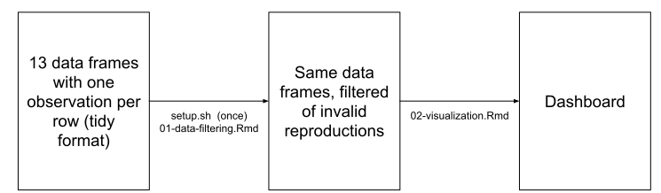

# SSRP_dashboard

This repo contains the scripts used to produce the visualizations used in the SSRP dashboard.

<https://bitss.github.io/SSRP_dashboard/>

# Setup

The `01-data-filtering.Rmd` script adds tidy dataframes from the [SSRP_cleaning](https://github.com/BITSS/SSRP_cleaning) repository to the `/processed/` directory, which is a folder one must create manually, after cloning the repo. To facilitate this, you need to make an `.Renviron` file with the line `clean_path = <LOCAL PATH TO SSRP_cleaning>`. We have written a bash script to do this for you. After cloning this repo, navigate to it in the console and run `bash setup.sh`. You will be prompted to provide the path on your local machine to the `SSRP_cleaning` repo. For Windows user, in the path you input into the console, please replace all single backward slashes with double backward slashes.

# Updating the Dashboard

Performing a full update of the dashboard involves three steps:

1.  The tidy data frames need to be updated with the latest data. This is done in the [SSRP_cleaning](https://github.com/BITSS/SSRP_cleaning) repository by running `bash runall.sh`.

2.  We make the html for the updated dashboard. This is done by knitting `04-visualization.Rmd` in this repo.

3.  Once the updated `index.html` file is pushed it should be reflected on the [SSRP Metrics page](https://www.socialsciencereproduction.org/metrics) in 5-10 minutes.
